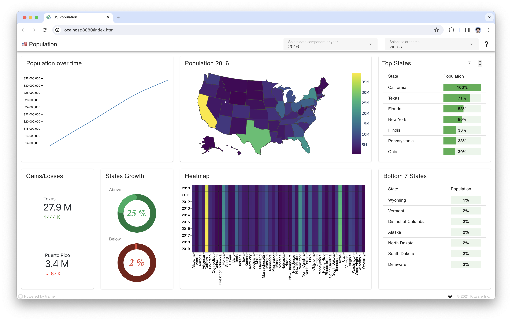

# Dashboard example with trame

[](https://mybinder.org/v2/gh/Kitware/trame-app-dashboard/HEAD?labpath=example.ipynb)

The current example illustrate trame usage when building a reactive dashboard using altair, plotly, matplotlib and vuetify.



# Build the image

```bash
docker build -t trame-app-dashboard .
```

# Run the image on port 8080

```bash
docker run -it --rm -p 8080:80 trame-app-dashboard
```

# Deploying into CapRover

If that directory was at the root of a git repo you could run the following command line

```bash
caprover deploy
```

That app could also be deployed by running the following set of commands

```bash
tar -cvf trame-app-dashboard.tar captain-definition Dockerfile us_population.py us_population.csv setup
caprover deploy -t trame-app-dashboard.tar
```
